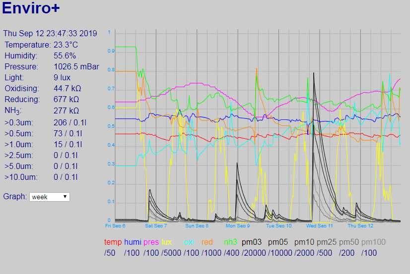

# EnviroPlusWeb
Web interface for Enviro+ sensor board plugged into a Raspberry PI

A very simple Flask application that serves a wep page with the current sensor readings and a graph over a specified time period.

By default it expects a particle sensor to be attached. Change line 20 of app.py to `particle_sensor = False` to run without one.

Run `sudo ./install-service.sh` and it will be installed as a service that starts on boot.

